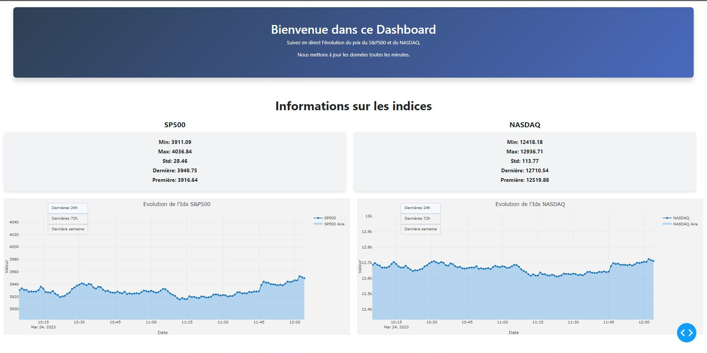

# Stock Indices Dashboard Project

## Overview

This project provides an interactive dashboard developed with Dash to track the real-time evolution of the S&P 500 and NASDAQ stock indices. The data is updated every minute and presents a graphical visualization of the indices' evolution along with some basic statistics.



## Features

- **Real-Time Graphs**: Visualize the evolution of the S&P 500 and NASDAQ indices with interactive graphs.
- **Live Statistics**: Obtain real-time statistics such as the minimum, maximum, standard deviation, last, and first value for each index.
- **Automatic Update**: Data and visualizations are automatically updated every minute.

## How Does It Work?

Data is extracted, processed, and stored in a CSV file. Then, the dashboard reads this file and updates the graphs and statistics in real-time.

## Technologies Used

- **[Python](https://www.python.org/)**: Programming language used for data processing and dashboard creation.
- **[Dash](https://dash.plotly.com/)**: Python framework used to create the web application and interactive dashboard.
- **[Plotly](https://plotly.com/)**: Python library for creating interactive graphs.

## How to Run the Project?

1. Clone the GitHub repository.
2. Ensure that Python and the necessary libraries (Dash, Plotly, etc.) are installed.
3. Run the `main.py` script to start the Dash server.
4. Open your web browser and go to `localhost:8050` to see the dashboard in action.

## Important Note

The main Python script is run in the "Session_active" tmux session. To access it, use: 
```shell
tmux attach -t Session_active
```
IP to access the site: [http://13.53.150.105:8050/](http://13.53.150.105:8050/)

## Author

[Rostane F](https://github.com/RostaneF)

# Linux and Git Commands Guide

This repository serves as a quick reference guide to recall basic Linux and Git commands, as well as concepts for working with SSH/AWS.

## [Basic Linux Commands](https://github.com/RostaneF/TD-git_linux/blob/main/CommandesBasiques/TD1.txt)

### Navigation and File Management
- `cd [directory]`: Change the current directory.
  - Example: `cd Documents/`
- `ls`: List files and directories.
  - Example: `ls -la`
- `pwd`: Display the path of the current directory.
  - Example: `pwd`
- `mkdir [directory_name]`: Create a new directory.
  - Example: `mkdir NewFolder`
- `touch [file_name]`: Create a new file.
  - Example: `touch example.txt`
  
### File Manipulation
- `mv [source] [destination]`: Move or rename files/directories.
  - Example: `mv old.txt new.txt`
- `cp [source] [destination]`: Copy files/directories.
  - Example: `cp source.txt copy.txt`
- `rm [file_name]`: Delete a file. Use `rm -r [directory_name]` to delete a directory.
  - Example: `rm unwanted.txt`
  
### Permissions and Ownership
- `chmod [permissions] [file/directory]`: Change the permissions of a file/directory.
  - Example: `chmod 755 script.sh`
- `chown [user:group] [file/directory]`: Change the owner and group of a file/directory.
  - Example: `chown user:group example.txt`

### Display and Search
- `echo [text]`: Display a string of text.
  - Example: `echo "Hello, World!"`
- `cat [file_name]`: Display the content of a file.
  - Example: `cat example.txt`
- `grep [pattern] [file_name]`: Search for a string in a file.
  - Example: `grep "search_term" example.txt`

### Package Installation
- `apt update && apt upgrade`: Update the package list and installed packages.
  - Example: `sudo apt update && sudo apt upgrade`
- `apt install [package_name]`: Install a package.
  - Example: `sudo apt install vim`

## [Git Commands](https://github.com/RostaneF/TD-git_linux/blob/main/CommandesBasiques/TD_Git.txt)

### Configuration and Initialization
- `git config`: Configure Git user settings.
  - Example: `git config --global user.name "Your Name"`
- `git init`: Initialize a new Git repository.
  - Example: `git init`

### Tracking Changes
- `git add [file_name]`: Add a file to the index.
  - Example: `git add example.txt`
- `git commit -m "[message]"`: Save changes with a commit message.
  - Example: `git commit -m "Add example.txt"`

### History and Navigation
- `git log`: Display the commit history.
  - Example: `git log`
- `git diff [commit_hash]`: Display differences between commits.
  - Example: `git diff abc123`
- `git checkout [commit_hash/branch_name]`: Change the working head to a specific commit or branch.
  - Example: `git checkout feature-branch`

### Interaction with GitHub
- `git clone [repository_url]`: Clone a remote repository.
  - Example: `git clone https://github.com/user/repo.git`
- `git push [remote_name] [branch_name]`: Push local changes to a remote repository.
  - Example: `git push origin main`
- `git pull [remote_name] [branch_name]`: Fetch changes from a remote repository.
  - Example: `git pull origin main`

## [Working with SSH/AWS](https://github.com/RostaneF/TD-git_linux/blob/main/CommandesBasiques/TD_Scrap_aws)

- `crontab`: Schedule tasks to run automatically at specified intervals.
  - Example: `crontab -e` (to edit the crontab file)
- `grep`: Search for patterns in files.
  - Example: `grep "pattern" filename`
- `curl`: Transfer data to or from a server.
  - Example: `curl http://example.com`
- `sed`: Stream editor for filtering and transforming text.
  - Example: `sed 's/old/new/g' filename`
- SSH/AWS: Use SSH to connect to AWS and manage your EC2 instances.
  - Example: `ssh -i "your-key.pem" [email protected]`

---

